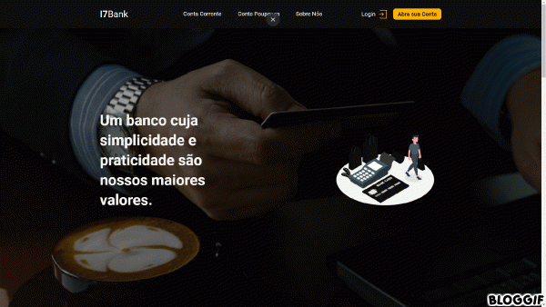

<h1 align='center'>
    
</h1>

<h1>
    
</h1>

# 📃 Sobre

O Projeto **I7Bank** é um sistema bem simples de um banco online desenvolvido por mim, com o objetivo de colocar em prática o paradigma de orientação a objetos com integração ao banco de dados utilizando PDO.

Atualmente o sistema permite ao usuário somente as funcionalidades de saque e depósito, porém irei refatorando o código e adicionando novas features no futuro 👌

---

## ✅ Tecnologias Utilizadas

O projeto foi desenvolvido utilizando as seguintes tecnologias

- PHP
- JS
- HTML
- CSS

---

## 📦 Como baixar o Projeto


```bash

    # Clonar o repositório
    $ git clone https://github.com/we2l/i7bank

    # Entrar no diretório
    $ cd i7bank

```
---
Desenvolvido por Weslley Araujo 